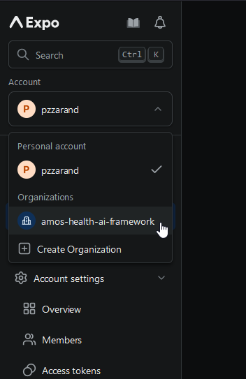
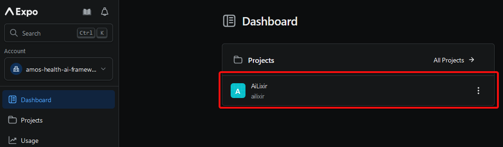
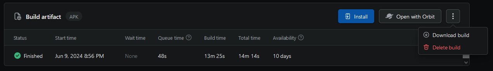
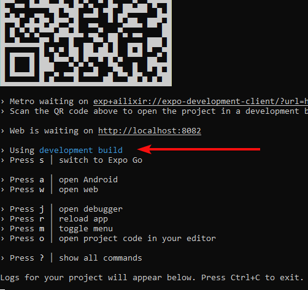

# Build and Run the App

## Build

For the app environment, we use the package manager [yarn](https://classic.yarnpkg.com/lang/en/docs/install/#windows-stable). You can install it via npm

```bash
npm install --global yarn
yarn --version #check version
```

In the cloned project (refer to [[Build Documentation]]) root, we can now install all the needed dependencies for the app by running the command

```bash
yarn
```
This will also download the [expo](https://expo.dev/) framework which we use to deploy and run the app.

## Install the App on Your Phone

You can either execute the app on your personal phone or an emulator. The following steps will require access to a development build. Ask one of the friendly developers of this repository :).

### Get the Development Build

To download a development build, sign into your expo account [here](https://expo.dev/). Click on the `amos-health-ai-framework` organization.



Now, click on the `AiLixir` project.



On the left side, navigate to `Builds`. Click on the topmost build. Now click on `Install`.



Scan the showing QR-code with your device, et voilà, it will install the development build on your device. Alternatively, if you want to use an **emulator**, click on the three dots to the right and download the build on your computer. Once you have the emulator running, drag the donwloaded build file on your emulator.


### Emulator

You can use [Android Studio](https://developer.android.com/studio) to set up an emulator. Follow the steps detailed under `Set up Android Studio` on the official [expo documentation](https://docs.expo.dev/workflow/android-studio-emulator/#set-up-android-studio).

## Run the App

Once you have installed the dependencies and the development build of the app, you are ready to run it! :) If you haven't already In your terminal, execute

```bash
yarn start
```

It should say `Using development build`, otherwise press `'s'`.



Now on your device, scan the QR code. If you are using an emulator you can instead press `'a'`.

Et voilà, this should run the app on the chosen device.