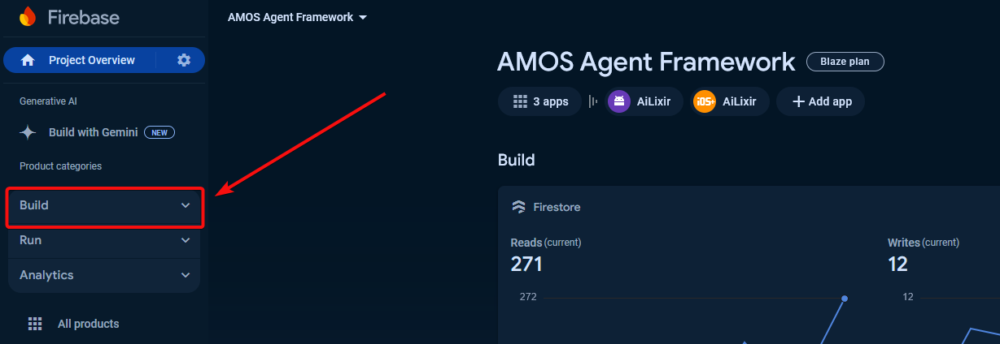
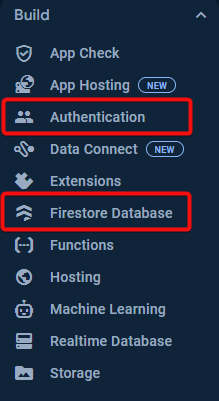
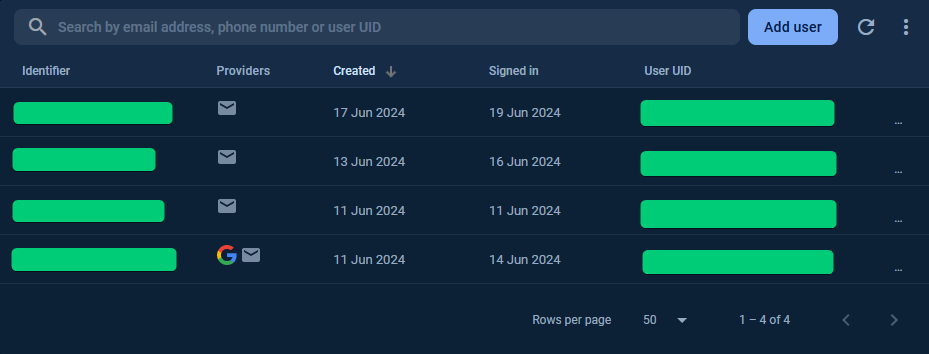
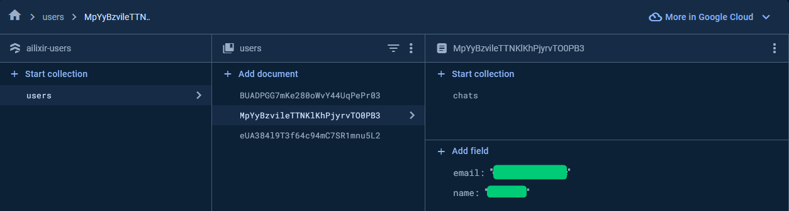
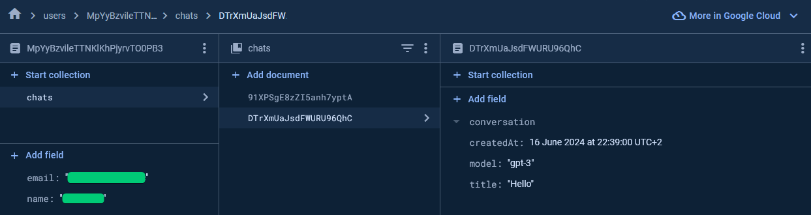

# Navigating the Firebase Database

The Firebase Database is mainly used for the frontend app. It can be accessed via the web interface or api methods in react native.

## Requirements
- Access to the [firebase project](https://console.firebase.google.com/project/amos-agent-framework/overview) (can be granted by the software developers)
- Firebase account (login with a google account is also possible)
- For react native development: firebase configuration in `.env` file in the project root directory (containing api keys and similar, message a developer to get the contents)

## Web Interface

Open the [Amos Agent Framework Project](https://console.firebase.google.com/project/amos-agent-framework/overview) in your web browser. Probably the two main functionalities that are needed can be found under `Build/Authentication` and `Build/Firestore Database`

### 1.)
  
### 2.)

### Authentication

In this tab you can see and manage (if you have the rights) information concerning user accounts registered in the app. Different sign-in methods can be set up (e.g. google and email signin). This tab can also be used to add new users, reset passwords, see registered email-addresses which partain to account user UIDs, etc.

### Firestore Database

In the firestore database you can organise data into collections that contain documents. The entries in this database can be retrieved in react native to for example display a username or chat.

At this moment, we have a `users` collection containing all the users.

Here you can also create a user for yourself for testing purposes. For reference, see the already existing users.

Each user can possess a `chats` collection containing all the different conversations with the chatbots. Here you can create new chats or see existing ones.

Right now, a chat contains a `conversation` array, `createdAt` timestamp, `model` string and a `title` string.

## React Native API

For usage of the stored data in react native, you can for example take a look at the `src/frontend/hooks/` directory where different hooks for retrieving chat data are already implemented.
